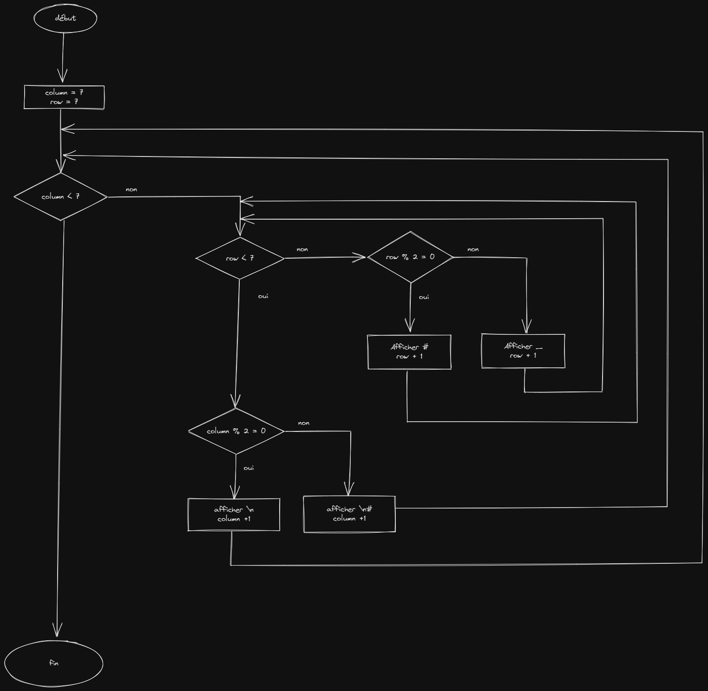

# ChessBoard

## Algorigramme



## Pseudo code

```

variable chessboard : chaine de charactère;
variable column : entier;
variable row : entier;


column <- 0
row <- 0
chessboard <- ""

Pour column de 0 à 7 par pas de 1 faire
    Pour row de 0 à 7 par pas de 1 faire
        si module(row, 2) est égale à 0
            chessboard <- chessboard + "_"
        sinon
            chessboard <- chessboard + "#"
    fin pour

    si module(column, 2) est égale à 0
        chessboard <- chessboard + "\n#"
    sinon
        chessboard <- chessboard + "\n"
fin pour

```