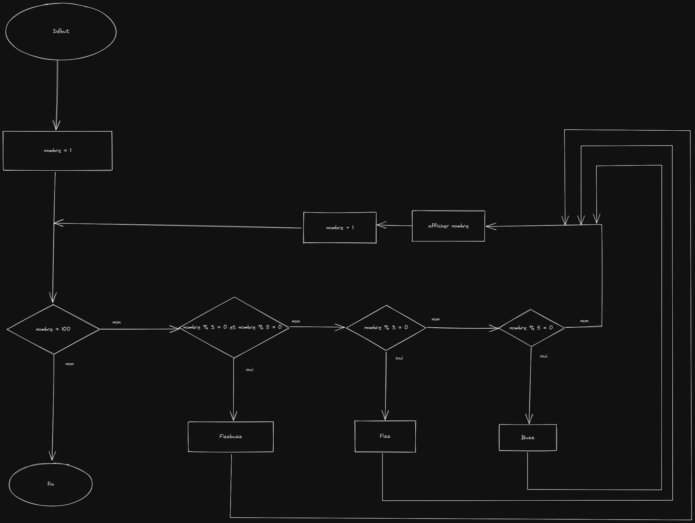

# FizzBuzz

## Algorigramme



---

## Pseudo code

```

nombre <- 0

pour nombre de 0 à 100 par pas de 1 faire
    si modulo(nombre, 3) est égale à 0 et si modulo(nombre, 5) est égale à 0
        Ecrire Fizzbuzz
        
    si modulo(nombre, 3) est égale à 0
        Alors Ecrire Fizz
    
    si modulo(nombre, 3) est égale à 0
        Alors Ecrire Buzz
    sinon 
        Ecrire nombre

```

## Javascript

```js


for(let i = 1; i != 100; i++){

    if(i % 3 == 0 && i % 5 == 0)
        console.log('fizzbuzz');
    

    if(i % 3 == 0)
        console.log('fizz');
    

    if(i % 5 == 0)
        console.log('buzz');
    else
        console.log(i);
}

```