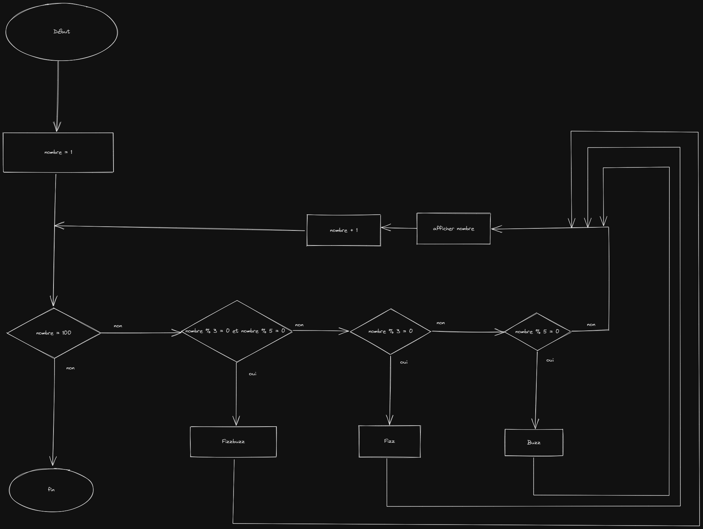

# FizzBuzz

## Algorigramme

---

## Pseudo code

nombre <- 0

pour nombre de 0 à 100 par pas de 1 faire
    si modulo(nombre, 3) est égale à 0 et si modulo(nombre, 5) est égale à 0
        Afficher Fizzbuzz
        
    si modulo(nombre, 3) est égale à 0
        Alors afficher Fizz
    
    si modulo(nombre, 3) est égale à 0
        Alors afficher Buzz
    sinon 
        Afficher nombre