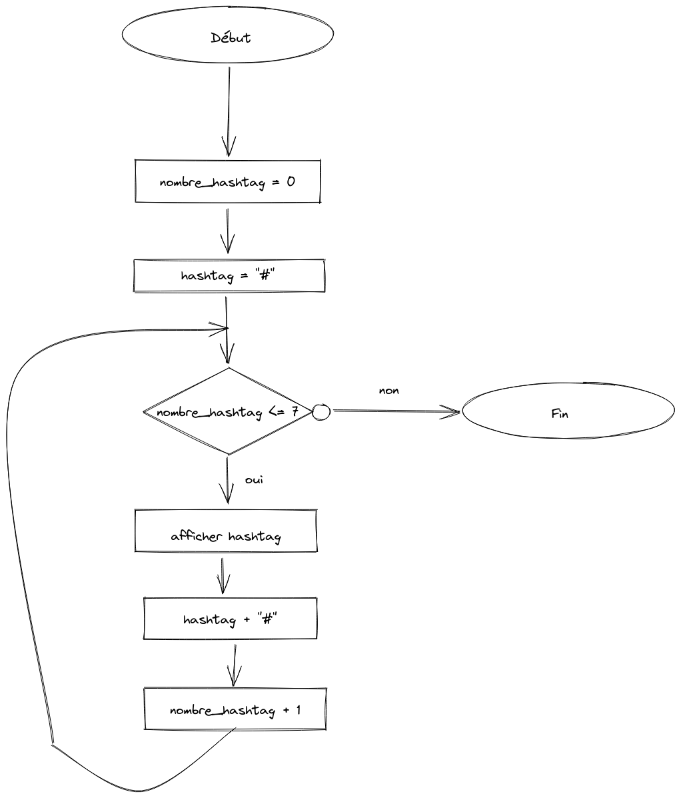

# KATA JS EXERCICE

## Looping Triangle

### Algorigramme 



---

### Pseudo code

```

hashtag_nombre <- 0
hastag <- "#"

pour hastag_nombre de 0 à  7 par pas de 1 faire
    Ecrire hashtag
    hashtag <- hashtag + "#"
fintantque

```

## Javascript

```js

let hashtag = "#"

for(let i = 0; i < 7; i++){
    console.log(hashtag);
    hashtag = hashtag + "#"
}

```