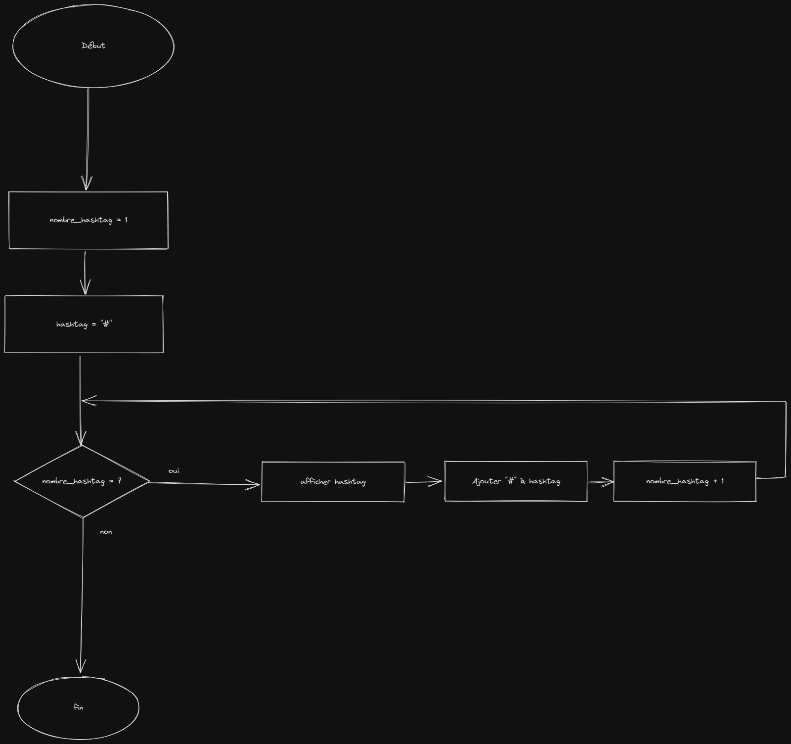

# KATA JS EXERCICE

## Looping Triangle

### Algorigramme 



---

### Pseudo code

```

hashtag_nombre <- 0
hastag <- "#"

pour hastag_nombre de 0 à  7 par pas de 1 faire
    saisir hashtag
    hashtag <- hashtag + "#"
fintantque

```


