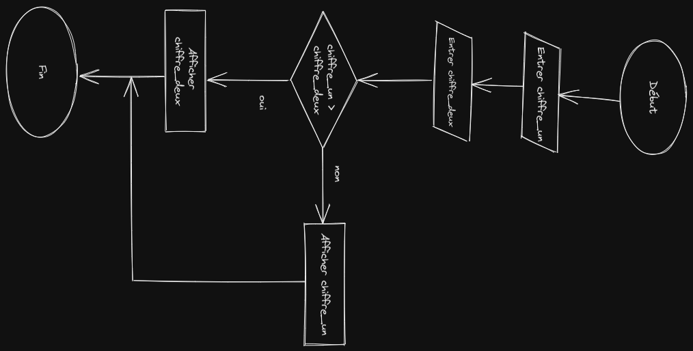

# Minimum

## Algorigramme



---

## Pseudo code

```

Lire value_un
Lire value_deux

si value_un est supérieur à value_deux
    Ecricre value_un
sinon
    Ecrire value_deux

```

## Javascript

```js

console.log(min(0, 10));
console.log(min(0, -10));

function min(value_un, value_deux){
    if(value_un > value_deux){
        return value_un
    }

    return value_deux
}

```