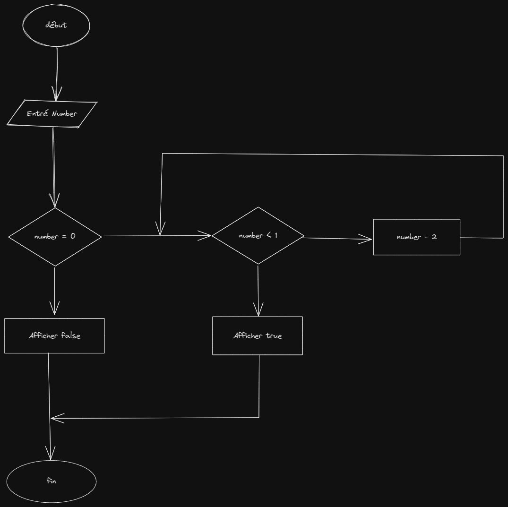

# Recursion

## Algorigramme




## Pseudo code

```
isEven(number) : boolean

number : entier

si number est égale à 0
    renvoyer false
sinon si number est inferieur à 1
    renvoyer true
sinon
    renvoyer isEven(number - 2)

```

## Javascript

```js

function isEven(number){
    
    if(number > 1){
        return isEven(number - 2)
    }

    if(number == 0){
        return true;
    }

    return false
}

console.log(isEven(11));

```
